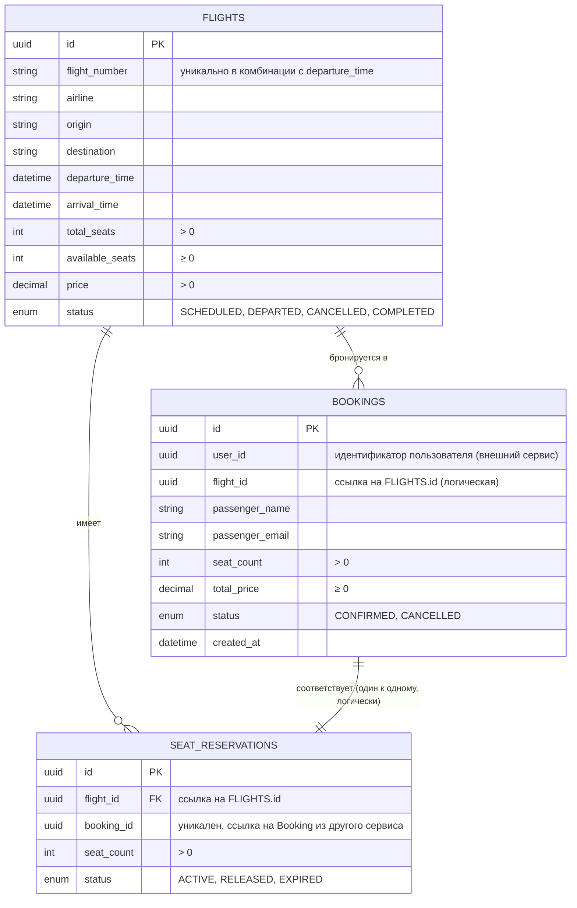

### ER-диаграмма

```mermaid
erDiagram
    FLIGHTS {
        uuid id PK
        string flight_number "уникально в комбинации с departure_time"
        string airline
        string origin
        string destination
        datetime departure_time
        datetime arrival_time
        int total_seats "> 0"
        int available_seats "≥ 0"
        decimal price "> 0"
        enum status "SCHEDULED, DEPARTED, CANCELLED, COMPLETED"
    }

    SEAT_RESERVATIONS {
        uuid id PK
        uuid flight_id FK "ссылка на FLIGHTS.id"
        uuid booking_id "уникален, ссылка на Booking из другого сервиса"
        int seat_count "> 0"
        enum status "ACTIVE, RELEASED, EXPIRED"
    }

    BOOKINGS {
        uuid id PK
        uuid user_id "идентификатор пользователя (внешний сервис)"
        uuid flight_id "ссылка на FLIGHTS.id (логическая)"
        string passenger_name
        string passenger_email
        int seat_count "> 0"
        decimal total_price "≥ 0"
        enum status "CONFIRMED, CANCELLED"
        datetime created_at
    }

    FLIGHTS ||--o{ SEAT_RESERVATIONS : "имеет"
    FLIGHTS ||--o{ BOOKINGS : "бронируется в"
    BOOKINGS ||--|| SEAT_RESERVATIONS : "соответствует (один к одному, логически)"
```
