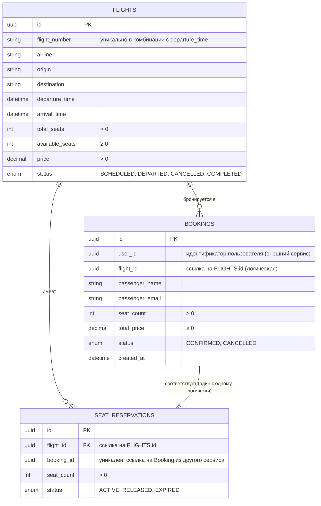

### ER-диаграмма




# SLI (Service Level Indicators)

## 1. Доступность API (Booking Service)
- **Что измеряется:** доля успешных запросов (не 5xx) за последние 5 минут.
- **PromQL:**
  ```promql
  sum(rate(http_requests_total{job="booking-service",status!~"5.."}[5m]))
  /
  sum(rate(http_requests_total{job="booking-service"}[5m]))
  ```
- **SLO:** > 99.5%
- **Порог отказа:** < 95%
- **Использование:** проверка в CI после нагрузочного теста, алерт `HighErrorRate_Booking`.

## 2. Задержка p95 (Booking Service)
- **Что измеряется:** 95-й перцентиль времени ответа на запросы за последние 5 минут.
- **PromQL:**
  ```promql
  histogram_quantile(0.95,
    sum(rate(http_request_duration_seconds_bucket{job="booking-service"}[5m])) by (le)
  )
  ```
- **SLO:** < 500 мс
- **Порог отказа:** > 1000 мс
- **Использование:** проверка в CI, алерт `HighLatency_Booking`.

## 3. Доля серверных ошибок (Flight Service)
- **Что измеряется:** доля gRPC-вызовов с кодами INTERNAL, UNAVAILABLE, UNKNOWN, DATA_LOSS, ABORTED за последние 5 минут.
- **PromQL:**
  ```promql
  sum(rate(grpc_errors_total{job="flight-service",error_type=~"INTERNAL|UNAVAILABLE|UNKNOWN|DATA_LOSS|ABORTED"}[5m]))
  /
  sum(rate(grpc_requests_total{job="flight-service"}[5m]))
  ```
- **SLO:** < 1%
- **Порог отказа:** > 5%
- **Использование:** проверка в CI, алерт `HighErrorRate_Flight`.
