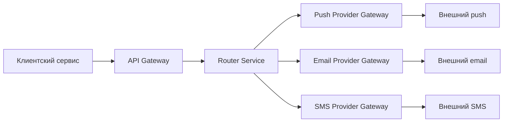
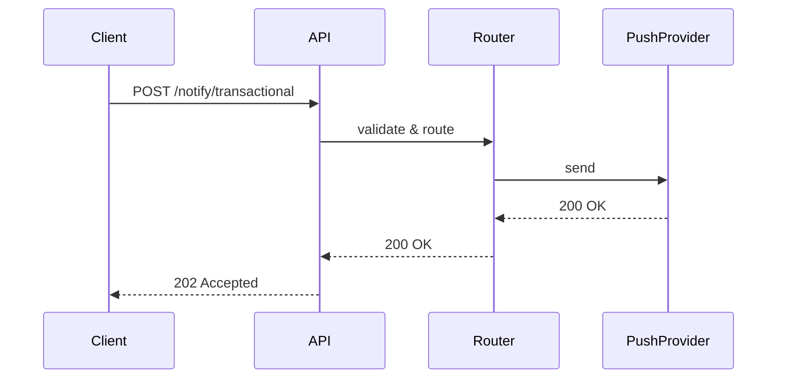
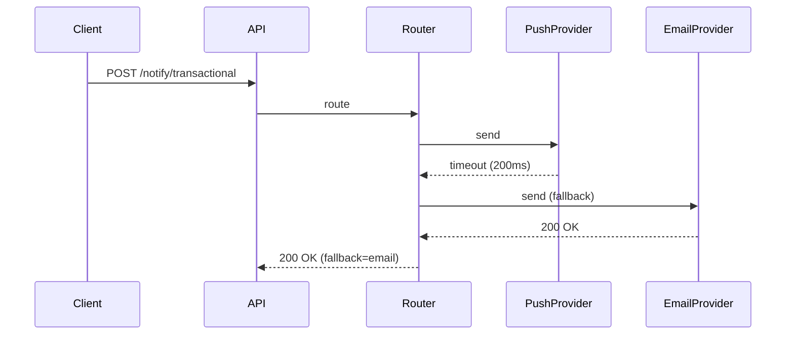
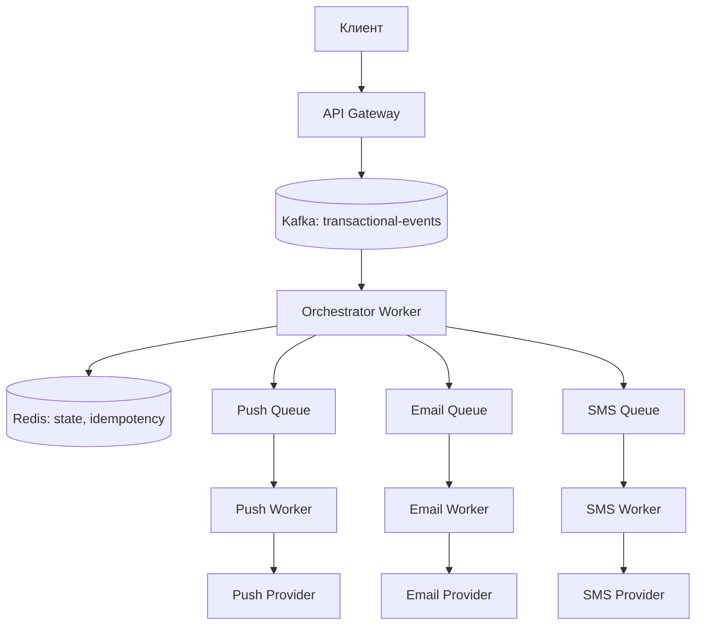
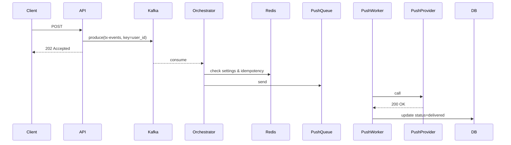
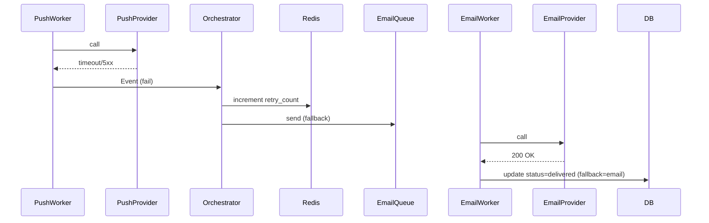

# Домашнее задание №4
#### Требования и архитектурное мышление

### Функциональные требования

1. Гарантированная доставка критичных уведомлений: cистема должна обеспечить доставку каждого транзакционного уведомления хотя бы через один канал.
2. Централизованное управление пользовательскими настройками: пользователь может отключить маркетинговые и сервисные уведомления по каждому каналу отдельно, транзакционные уведомления отключить нельзя.
3. Дедупликация уведомлений: система должна гарантировать, что одно и то же уведомление не будет доставлено более одного раза.
4. Поддержка массовых кампаний: система должна обрабатывать отправку маркетинговых уведомлений на аудиторию до 1 млн пользователей.
5. Прозрачность статусов доставки: система должна для каждого уведомления предоставлять актуальный статус с временными метками, доступными для мониторинга.

### Нефункциональные требования

1. Задержка доставки транзакционных уведомлений: 95% уведомлений доставляются за < 2 секунды, 99% - за < 5 секунд.
2. Надёжность доставки транзакционных уведомлений: 99.99% транзакционных уведомлений успешно доставлены хотя бы через один канал.
3. Пропускная способность: Система выдерживает пиковую нагрузку 5000 уведомлений/сек.
4. Доступность платформы: доступность сервиса 99.9%.
5. Наблюдаемость: время обнаружения отказа канала < 10 секунд.

### Архитектурно значимые требования (ASR)

#### ASR-1 - Низкая задержка транзакционных уведомлений

**Связанные требования:**
- Функциональное #1
- Нефункциональное #1

Почему влияет:  
Исключает синхронные вызовы к внешним провайдерам(SMS, email). Требует асинхронной очереди с приоритетами.

#### ASR-2 - Высокая нагрузка

**Связанные требования:**
- Функциональное #4
- Нефункциональное #3

Почему влияет:  
Требует горизонтального масштабирования всех компонентов. Массовые кампании не должны блокировать транзакционные уведомления, а значит нужны очереди с приоритетами.

#### ASR-3 - Гарантированная доставка при нестабильных внешних провайдерах

**Связанные требования:**
- Функциональное #1
- Функциональное #2
- Нефункциональное #2

Почему влияет:  
Требует реализации паттернов Retry с экспоненциальной задержкой, Circuit Breaker для провайдеров.

### Ключевые архитектурные вопросы

1. Как обеспечить приоритизацию транзакционных уведомлений перед маркетинговыми при пиковой нагрузке?  
Порождающие требования: ASR-1, ASR-2.  
Важность: без этого массовая рассылка может помешать транзакционным уведомлениям, нарушив SLA.

2. Как реализовать failover между каналами без дублирования, если подтверждение доставки от первого канала приходит с задержкой?  
Порождающие требования: ASR-1, ASR-3.  
Важность: без этого возможны дубли(SMS + Push), либо ложный failover и избыточные расходы на SMS.

3. Как применять пользовательские настройки каналов с учётом того, что транзакционные нельзя отключить, а маркетинговые - можно?  
Порождающие требования: Функциональное #2.  
Важность: влияет на схему БД и кэширование - нужно быстро проверять разрешён ли канал для данного типа уведомления.

### Ключевые архитектурные вопросы

#### ASR-1(низкая задержка)

- Асинхронная обработка с очередями
- Push-канал как первичный
- Геораспределённые worker'ы рядом с push-шлюзами

#### ASR-2(высокая нагрузка)

- Горизонтальное масштабирование
- Кэширование настроек пользователей в Redis

#### ASR-3(нестабильные провайдеры)

- Паттерны: Retry, Circuit Breaker
- Асинхронный механизм подтверждения доставки от провайдеров
- Мониторинг здоровья каналов

### Архитектурные решения, которые НЕ подходят

#### Решение 1 - Синхронная отправка через API внешних провайдеров без очередей

Нарушаемые ASR: ASR-1, ASR-2.  
Почему: при 5000 уведомлений/сек синхронный вызов провайдеров с задержкой приведёт к высокому времени ответа и таймаутам. Массовая кампания на 1 млн пользователей заблокирует сервис на часы.

#### Решение 2 - Единая очередь для всех типов уведомлений

Нарушаемые ASR: ASR-1, ASR-2.  
Почему: маркетинговая кампания из 1 млн сообщений создаст очередь длиной в миллионы элементов - транзакционное уведомление будет ждать своей очереди минуты, нарушая SLA.

### Неопределённости и архитектурные риски

#### Требования к наблюдаемости для failover

Как часто внешние провайдеры выдают ложные положительные ответы?
Как долго мы ждём подтверждения от push-провайдера перед переключением на SMS?

Как проверить: пилотное подключение к провайдерам с анализом метрик
- Доля false positive
- Распределение задержек подтверждения
- Частота полных отказов

#### Экономическая модель failover

SMS стоит в 10–50 раз дороже push. Как часто будет происходить автоматическое переключение на SMS при реальных отказах push? Не приведёт ли failover к росту затрат?

Как проверить:
- Симуляция отказа push-канала на тестовом стенде
- Расчёт стоимости для двух стратегий: failover через 2 секунды vs failover через 10 секунд
- Если есть, анализ логов - частота проблем с доставкой push

# RFC: Проектирование механизма гарантированной доставки критичных (транзакционных) уведомлений с автоматическим failover между каналами доставки

| Метаданные | Значение   |
|------------|------------|
| **Статус** | DESIGN     |
| **Автор(ы)** | ?          |
| **Ответственный** | ?          |
| **Бизнес-заказчик** | ?          |
| **Ревьюеры** | ?          |
| **Дата создания** | 2026-04-07 |
| **Дата обновления** | 2026-04-07 |

---

## Оглавление

1. [Контекст](#контекст)
2. [Продуктовый анализ](#продуктовый-анализ)
3. [Пользовательские сценарии](#пользовательские-сценарии)
4. [Статистика](#статистика)
5. [Требования](#требования)
6. [Варианты решения](#варианты-решения)
7. [Сравнительный анализ](#сравнительный-анализ)
8. [Выводы](#выводы)
9. [Связанные задачи](#связанные-задачи)

---

## Контекст

В настоящее время каждая команда в онлайн-банке отправляет уведомления пользователям самостоятельно: разные сервисы используют собственные подходы. Это приводит к:

- задержкам доставки
- дублированию сообщений
- отсутствию централизованного контроля и гарантий доставки критичных уведомлений

Мы создаём **централизованную платформу уведомлений (Notification Platform)**. В рамках данного RFC фокусируемся на самой сложной подсистеме - гарантированной доставке транзакционных (критичных) уведомлений с автоматическим failover между каналами** (push, email, SMS). Это напрямую влияет на пользовательский опыт, безопасность и retention.

### Ключевые вопросы
- Как обеспечить **гарантию доставки** при нестабильной работе внешних провайдеров?
- Как сохранить **низкую задержку** для критичных сценариев?
- Как автоматически переключаться с push на email/SMS без дублирования и с контролем стоимости?
- Кто затронут: все пользователи банка, команды, интегрирующиеся в Notification Platform.

---

## Продуктовый анализ

Бизнес-цели платформы:
- Увеличить **retention** пользователей на 15%.
- Снизить количество **жалоб** на уведомления на 30%.
- Обеспечить **гарантированную доставку** критичных уведомлений.

**Ценность для пользователя:**
- Списание денег или перевод подтверждаются мгновенно — нет тревоги «прошла ли операция?».
- Даже при проблемах с push уведомление придёт через email или SMS.
- Пользователь **не может отключить** транзакционные уведомления ни по одному каналу.

**Рыночный контекст:**
- Конкуренты (Т-Банк, Сбер) уже имеют надёжные системы уведомлений. Отставание = отток пользователей.
- Массовые кампании (1 млн пользователей) не должны подавлять критические уведомления.

---

## Пользовательские сценарии

| Приоритет | Тип сценария | Действующее лицо | Сценарий                                                                                                                                                                                                |
|-----------|--------------|------------------|---------------------------------------------------------------------------------------------------------------------------------------------------------------------------------------------------------|
| **MUST HAVE** | Транзакционный | Пользователь | Пользователь совершает перевод. Система должна отправить подтверждение и гарантировать, что оно будет доставлено хотя бы через один канал с задержкой < 2 сек.                                          |
| **MUST HAVE** | Failover | Платформа | Основной канал (push) недоступен или провайдер вернул ошибку. Система автоматически переключается на следующий канал без дублирования сообщения.                                                        |
| **SHOULD HAVE** | Отказоустойчивость провайдера | Платформа | Внешний провайдер работает нестабильно. Система использует Circuit Breaker и повторные попытки, затем переключается на альтернативного провайдера или другой канал.                                     |
| **SHOULD HAVE** | Настройки пользователя | Пользователь | Пользователь может отключить маркетинговые и сервисные уведомления по каналам, но транзакционные - никогда. Система учитывает эти настройки при выборе канала.                                          |
| **COULD HAVE** | Приоритизация каналов | Платформа | Система может динамически менять порядок каналов в зависимости от истории успешности доставки конкретному пользователю. |

---

## Статистика

### Ожидаемая нагрузка
- **MAU** = 10 млн пользователей
- **DAU** = 3 млн
- **Peak Concurrent Users** = 300 000

### Уведомления на пользователя в день
| Тип | Количество |
|-----|-------------|
| Транзакционные | 2 |
| Сервисные | 3 |
| Маркетинговые | 5 |
| **Итого** | **10** |

### Расчёт нагрузки только для транзакционных (критичных)
- Уведомлений в день: 3 млн DAU × 2 = **6 млн / день**
- Среднее в секунду: 6 млн / 86400 ≈ **70 уведомлений/сек**
- Пиковый коэффициент (утренний час-пик, вечер) = 5x от среднего  
  => **пик = 350 уведомлений/сек** (транзакционных)

**Общая нагрузка (все типы уведомлений):**
- 3 млн × 10 = 30 млн уведомлений/день  
- Среднее: 350 уведомлений/сек  
- Пик (с учётом массовых кампаний до 1 млн пользователей): до **1750 уведомлений/сек**

### Требования к хранилищам
- PostgreSQL для аудита: ~6 млн записей/день.
- Redis для временных состояний (попытки failover, idempotency): ~50 000 ключей одновременно (TTL 5 мин) => ~500 МБ памяти.

---

## Требования

### Функциональные требования

| № | Приоритет | Обозначение | Требование                                                                                                                                            |
|---|-----------|-------------|-------------------------------------------------------------------------------------------------------------------------------------------------------|
| 1 | MUST HAVE | FR1 | Система должна доставить каждое транзакционное уведомление хотя бы через один канал (push, email, SMS) даже при отказе основного канала.              |
| 2 | MUST HAVE | FR2 | Приоритет каналов по умолчанию: push => email => SMS. Пользователь не может отключить транзакционные уведомления ни по одному каналу.                 |
| 3 | MUST HAVE | FR3 | Если основной канал не подтвердил доставку за таймаут или вернул ошибку, система автоматически запускает failover на следующий канал.       |
| 4 | MUST HAVE | FR4 | Система предотвращает дублирование: одно и то же уведомление не может быть отправлено более одного раза.        |
| 5 | SHOULD HAVE | FR5 | Система поддерживает повторные попытки на том же канале с экспоненциальной задержкой перед переходом на следующий канал. |
| 6 | COULD HAVE | FR6 | Система может динамически менять порядок каналов на основе истории успешности доставки пользователю.                                                  |

### Нефункциональные требования

| № | Приоритет | Обозначение | Требование | Измеримость                               |
|---|-----------|-------------|-------------|-------------------------------------------|
| 1 | MUST HAVE | NFR1        | Задержка доставки транзакционных уведомлений (p95) | < 2 секунды                               |
| 2 | MUST HAVE | NFR2        | Успешность доставки транзакционных уведомлений | \> 99.99% (хотя бы через один канал)      |
| 3 | MUST HAVE | NFR3        | Пропускная способность (пиковая) | 5000 уведомлений/сек                      |
| 5 | MUST HAVE | NFR4        | Наблюдаемость | Время обнаружения отказа канала < 10 сек  |
| 6 | SHOULD HAVE | NFR5        | Доля ложных failover (когда основной канал доставил, но ответ задержался) | < 0.1%                                    |

### Архитектурно значимые требования (ASR)

| ID | ASR                                                                                     | Приоритет | Связанные требования | Почему влияет на архитектуру |
|----|-----------------------------------------------------------------------------------------|-----------|----------------------|------------------------------|
| ASR-1 | Низкая задержка транзакционных уведомлений (p95 < 2 сек)                                | HIGH | FR1, NFR1            | Исключает синхронные вызовы к медленным провайдерам в критическом пути. Требует асинхронной очереди с приоритетами и push как основного канала. |
| ASR-3 | Пропускная способность (пик 5000 уведомлений/сек) и поддержка массовых кампаний (1 млн) | HIGH | FR4, NFR3            | Требует горизонтального масштабирования, шардирования очередей, отделения транзакционных уведомлений от маркетинговых. |
| ASR-4 | Автоматический failover между каналами без дублирования                                 | HIGH | FR3, FR4, NFR6       | Требует механизма idempotency, распределённых блокировок и асинхронного подтверждения доставки. |

---

## Варианты решения

### Вариант 1: Синхронный маршрутизатор

> **Описание:** Все уведомления проходят через единый сервис Router, который синхронно вызывает каналы по порядку, ожидая ответа. При таймауте или ошибке немедленно переключается на следующий канал.

#### Архитектура

**Sequence (основной сценарий через push):**

**Sequence (failover push => email):**

#### Этапы реализации

| Этап | Описание | Срок | Ресурсы | Риски |
|------|----------|------|---------|-------|
| 1 | Реализовать Router Service с синхронными вызовами push/email/SMS | 2 недели | 1 бэкенд | Не учтены массовые кампании |
| 2 | Добавить кэш настроек пользователя (Redis) | 1 неделя | 1 бэкенд | Синхронный вызов может блокировать потоки |
| 3 | Интегрировать с существующими провайдерами | 2 недели | 1 бэкенд, 1 devops | Провайдеры могут не выдержать синхронной нагрузки |

#### Преимущества
- Простота реализации (один сервис, синхронная логика).
- Естественное предотвращение дублей (нет асинхронных гонок).
- Лёгкая отладка и трассировка.

#### Недостатки
- При 350+ уведомлениях/сек потребуется много потоков => блокировки, исчерпание соединений.
- Массовая кампания на 1 млн пользователей вызовет синхронные вызовы на часы.
- Нет механизма повторных попыток (только failover), что снижает успешность.
- Нет гибкости в приоритизации транзакционных vs маркетинговых.

---

### Вариант 2: Асинхронный оркестратор с очередями (выбранный)

> **Описание:** Уведомления поступают в Kafka, оркестратор (consumer) распределяет задания по очередям каналов (push, email, SMS). Workers обрабатывают асинхронно с retry, fallback через отдельные топики.

#### Архитектура (C4 Container)

**Sequence (основной сценарий через push):**

**Sequence (failover push => email):**

#### Этапы реализации

| Этап | Описание | Срок | Ресурсы | Риски |
|------|----------|------|---------|-------|
| 1 | Настроить Kafka, реализовать API Gateway (приём, публикация) | 2 недели | 2 бэкенда, 1 devops | Задержки при настройке Kafka |
| 2 | Оркестратор (consumer) + Redis state | 3 недели | 2 бэкенда | Сложность отладки распределённой логики |
| 3 | Workers для push, email, SMS с retry и Circuit Breaker | 3 недели | 2 бэкенда | Интеграция с внешними провайдерами |
| 4 | Failover механизм | 2 недели | 1 бэкенд | Риск дублей при гонках |
| 5 | Наблюдаемость (OpenTelemetry, дашборды) | 1 неделя | 1 devops + 1 бэкенд | — |

#### Преимущества
- Масштабируется горизонтально (workers, partitions).
- Транзакционные уведомления получают отдельный высокоприоритетный топик.
- Экономия SMS: можно сначала повторить push через другого провайдера.
- Полная наблюдаемость через трассировку.

#### Недостатки
- Более сложная архитектура (Kafka, Redis, несколько сервисов).
- Требуется идемпотентность и распределённые блокировки для предотвращения дублей.
- Дополнительная задержка на постановку в очередь (единицы мс, некритично).

---

## Сравнительный анализ

### Ресурсные требования

| Критерий | Вариант 1 (Синхронный router) | Вариант 2 (Асинхронный оркестратор) |
|----------|-------------------------------|-------------------------------------|
| Время реализации | 5 недель | 11 недель |
| Команда | 2 разработчика + 1 devops | 4 разработчика + 2 devops + 1 SRE |
| Инфраструктура | 1 сервис + Redis + PostgreSQL | Kafka (3 брокера) + Redis Cluster + Workers + PostgreSQL |
| Организационные риски | Низкие (просто) | Средние (нужны знания Kafka) |

### Соответствие требованиям

| Требование                                 | Вариант 1 | Вариант 2 |
|--------------------------------------------|-----------|-----------|
| FR1 (гарантия доставки)                    | ✅ Да (но без retry) | ✅ Да (retry + fallback) |
| FR2 (приоритет каналов, запрет отключения) | ✅ Да | ✅ Да |
| FR3 (автоматический failover)              | ✅ Да | ✅ Да |
| FR4 (предотвращение дублей)                | ✅ Да (синхронный вызов) | ✅ Да (idempotency keys) |
| NFR1 (задержка < 2 сек p95)                | ⚠️ 200-400 мс (хорошо) | ✅ 50-150 мс (лучше) |
| NFR2 (успешность 99.99%)                   | ❌ 99.9% (нет retry) | ✅ 99.99% (retry+fallback) |
| NFR3 (пропускная способность 5000/сек)     | ❌ Блокировка потоков | ✅ Горизонтальное масштабирование |
| NFR4 (наблюдаемость)                       | ✅ Метрики в одном сервисе | ✅ Распределённая трассировка |

---

## Выводы

> **Рекомендация:** Выбрать **Вариант 2 (Асинхронный оркестратор с очередями)**.

### Обоснование выбора

1. **Масштабируемость** – при 5000 уведомлений/сек синхронный router упрётся в лимиты потоков и соединений, а очередь (Kafka) буферизирует нагрузку и позволяет горизонтально добавлять workers.
2. **Надёжность** – требование 99.99% доставки невозможно достичь без повторных попыток (retry) на том же канале и гибкого failover. Вариант 1 при первом же таймауте переключает канал, теряя шанс на успех при временном сбое.
3. **Приоритизация** – асинхронная модель позволяет выделить отдельный topic для транзакционных уведомлений, который никогда не блокируется массовыми маркетинговыми кампаниями.
4. **Экономическая эффективность** – вариант 2 даёт возможность сначала повторить push (дёшево) и только потом переходить на SMS (дорого). Вариант 1 переключается мгновенно, увеличивая затраты.
5. **Наблюдаемость** – несмотря на сложность, распределённая трассировка даёт полную картину жизненного цикла уведомления, что критично для SRE.

### Компромиссы, принятые в варианте 2

| Компромисс | Почему принят |
|------------|---------------|
| Сложность архитектуры (Kafka, Redis Cluster, несколько workers) | Оправдана требованиями к масштабу и надёжности. Для упрощения можно начать с одного брокера Kafka и одного Redis instance, а кластеризацию добавить позже. |
| Дополнительная задержка на постановку в очередь (~5-10 мс) | Незначительно по сравнению с задержкой провайдеров (50-500 мс) и укладывается в SLA 2 секунды. |
| Риск дублей при failover (гонки) | Решается idempotency keys и распределёнными блокировками (Redlock). Потери от редких дублей ниже, чем от недоставки. |

---

## Связанные задачи

| Задача | Команда | Срок | Зависимость |
|--------|---------|------|--------------|
| Проектирование пользовательских настроек (какие каналы отключать) | Product + Backend | До старта разработки | Нет |
| Выбор и контракты с резервными провайдерами (SMS, email) | Procurement + Tech | До этапа интеграции | Нет |
| Разработка API для приёма уведомлений (единый gateway) | Platform Team | Параллельно с RFC | Нет |
| Миграция существующих сервисов на новую платформу | Все команды | После готовности платформы | Готовность платформы |
| Настройка мониторинга и алертов (Prometheus/Grafana) | SRE | Этап 5 | — |

---

## Приложения

### Глоссарий

| Термин | Определение |
|--------|-------------|
| Транзакционное уведомление | Уведомление о движении денежных средств (перевод, списание, пополнение). Не может быть отключено пользователем. |
| Failover | Автоматическое переключение на резервный канал доставки при отказе основного. |
| Circuit Breaker | Паттерн, предотвращающий повторные вызовы к нестабильному внешнему сервису. |
| Idempotency key | Уникальный ключ операции, позволяющий безопасно повторять запросы без дублирования. |
| Retention | Удержание пользователей — метрика, показывающая, как часто пользователи возвращаются в банк. |
